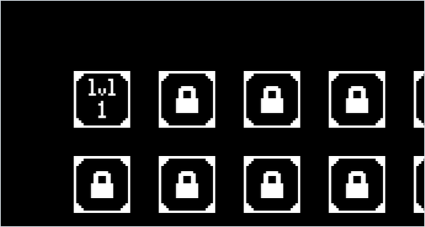

<div align="center">

# Parabola Targets

*A slingshot puzzle game: drag back to launch a ball on a parabolic path around walls and into a target.*




</div>

## About

A five-level physics puzzle in a 1500 × 800 Pygame window. You pull back from a launch zone on the left as with a slingshot, and the ball flies on a parabola that has to get over a block, pass under a hanging wall, or cross a region where gravity points upwards before it reaches a target on the right edge. Each hit unlocks the next level in a menu of padlocked buttons.

The physics, collisions and menu are written from scratch. The only images are hand-drawn bitmaps for the level buttons, the padlock and the target.

## Quick start

```bash
python -m pip install -r requirements.txt
python main.py
```

Run it from the repository folder so the bitmaps load.

## Controls

| Input | Action |
| --- | --- |
| Click an unlocked level button | Start that level |
| Press left of the red line, drag, release | Launch a ball opposite to the drag, faster for a longer drag |
| Close the window | Quit |

## How it works

- **Launch.** The ball appears where you pressed. With $(x_1, y_1)$ the press point and $(x_2, y_2)$ the release point, both in screen coordinates with $y$ pointing down, the initial velocity in pixels per frame is

  ```math
  (v_x,\; v_y) = \tfrac{1}{70}\,\bigl(x_1 - x_2,\; y_2 - y_1\bigr)
  ```

  where $v_y > 0$ means upwards.

- **Gravity.** The per-frame pull is computed once, Newton-style, from $g = 9.81$, an "Earth mass" (`masa_tierra`) $M = 10$, the ball's mass $m = 10$ and a fixed distance of 400, which gives about 0.0061 px per frame². Each frame updates the velocity first and then the position, a semi-implicit Euler step of one frame:

  ```math
  a = \frac{g\,M\,m}{400^2},\qquad v_y \leftarrow v_y - a,\qquad x \leftarrow x + v_x,\qquad y \leftarrow y - v_y
  ```

  Without bounces, $x$ grows linearly and the height quadratically in the frame count, so the ball's positions lie exactly on a parabola.

- **Bounces.** Before each step the ball checks whether its next position would enter a white block or leave the window. If it would, the velocity component normal to that surface is reversed and multiplied by 0.8, and the other component is multiplied by 0.9. Missed balls stay on the field until the level is won.
- **Gravity zones.** An invisible rectangle (`Obstaculo_g`) can turn gravity down, left, up or right (directions 1 to 4) while the ball is inside it.
- **Target** (`diana`). It is a 45 × 65 px rectangle at the right edge, and a hit means the ball's centre is inside it. A hit unlocks the next button, clears all balls and returns to the menu.
- **Levels.**
  1. An open field and a fixed target.
  2. A 200 px wide block rising 300 px from the floor.
  3. A wall hanging from the ceiling with a 100 px gap above the floor, so the ball has to pass under it and bounce up.
  4. The block from level 2, with the target moving up and down at 1 px per frame.
  5. No blocks, the moving target, and gravity pointing upwards over the right half of the screen.

## Code map

| Path | Role |
| --- | --- |
| `main.py` | The whole game: menu, level setup, ball physics, collisions and main loop |
| `lvl1.bmp` … `lvl12.bmp` | 23 × 23 px level-button icons, scaled up in the menu. Only 1 to 10 get a button |
| `candado.bmp` | Padlock icon (`candado`) drawn over locked levels |
| `diana.bmp` | Target sprite, a 9 × 13 pixel-art image stored at 900 × 1300 |

## Limitations

- Only levels 1 to 5 exist. Winning level 5 unlocks the level 6 button, but choosing it leaves the screen frozen on the menu, and the only way out is to close the window.
- The buttons for levels 5 and 10 are placed at x = 1460–1660, so only a 40 px strip of them shows in the 1500 px window.
- The main loop has no frame cap (no `Clock.tick`) and every quantity is per frame, so the game's speed depends on the machine.
- If a ball hits the target while you are dragging the next shot, the game returns to the menu still in aiming mode and ignores every later click.
- The side-collision test predicts the next position with `y + vy` while the step uses `y - vy`, so hits near a block's corner can reverse the wrong component. Level 3 also defines a second block at y = 950–1000, below the window, which has no effect.
- Progress is not saved, and there is no way back to the menu without hitting the target.

---

<div align="center"><sub>Part of <a href="https://github.com/lnivan">lnivan's projects</a> · <b>Games</b></sub></div>
